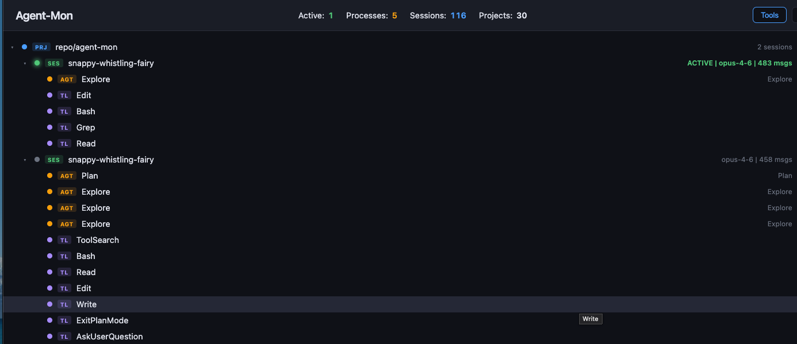

# Agent-Mon

Real-time visual monitoring dashboard for [Claude Code](https://docs.anthropic.com/en/docs/claude-code) agents. See all your running sessions, subagents, tools, and skills as an interactive force-directed graph.




## Features

- **Live force-directed graph** — projects, sessions, subagents, and tools rendered as interactive nodes
- **Active session detection** — running sessions pulse green, detected via process inspection + file modification times
- **Connected node animation** — nodes connected to active sessions glow with color-coded pulses (blue for projects, orange for subagents, purple for tools), with flowing particles along active edges
- **Real-time updates** — file watcher + SSE push changes to the browser as they happen
- **Session detail panel** — click any session to see model, tools used, skills, subagents, git branch, timestamps, token usage, cache hit rates, and more
- **Tree view** — browse the full project/session/subagent/tool hierarchy as a collapsible tree
- **Metrics dashboard** — aggregate stats across all sessions: token usage, tool reliability, stop reasons, model usage, most accessed files, heaviest sessions
- **Theme support** — dark, light, and Claude Code themes with persistent preference
- **Tool hub visualization** — shared tool nodes show which tools are most used across sessions
- **Filter controls** — toggle tool nodes on/off, filter to active sessions only

## How it works

Agent-Mon reads directly from Claude Code's local data files in `~/.claude/projects/`:

| Data Source | What it provides |
|---|---|
| `<project>/<sessionId>.jsonl` | Messages, tool calls, model, timestamps, token usage, stop reasons |
| `<project>/<sessionId>/subagents/agent-*.meta.json` | Subagent types (Explore, Plan, etc.) |
| `<project>/<sessionId>/subagents/agent-*.jsonl` | Subagent tool usage |
| `<project>/sessions-index.json` | Session summaries, message counts |
| `~/.claude/stats-cache.json` | Aggregate usage stats |

Active sessions are detected by cross-referencing running `claude` processes (via `ps` + `lsof`) with recently modified session files.

### Metrics extracted per session

- **Token usage** — input, output, cache write, cache read tokens
- **Cache efficiency** — cache hit rate (cache read / total cache tokens)
- **Tool success/failure rates** — per-tool success and error counts
- **Stop reasons** — end_turn, tool_use, max_tokens, stop_sequence distribution
- **File access patterns** — which files were read, edited, or written
- **Conversation flow** — user/assistant message counts, session duration, average turn latency

## Quick start

```bash
git clone https://github.com/jonra/agent-mon.git
cd agent-mon
npm install
npm start
```

Open [http://localhost:3000](http://localhost:3000)

## Requirements

- **Node.js** >= 18
- **Claude Code** installed and used (needs `~/.claude/projects/` to exist)
- **macOS** or **Linux** (uses `ps` and `lsof` for process detection)

## Project structure

```
agent-mon/
  server.js              # Express server, API endpoints, SSE
  lib/
    scanner.js           # Discovers projects/sessions/subagents from ~/.claude
    parser.js            # Parses JSONL session logs (tokens, tools, files, etc.)
    process-detector.js  # Detects running claude processes
    watcher.js           # File system watcher (chokidar)
    graph-builder.js     # Builds D3-compatible graph data with active propagation
  public/
    index.html           # Dashboard page
    app.js               # D3 force graph, tree view, metrics, SSE consumer
    style.css            # Dark/light/Claude theme styling + animations
```

## API

| Endpoint | Description |
|---|---|
| `GET /` | Dashboard UI |
| `GET /api/graph` | Full graph JSON (nodes + edges) |
| `GET /api/session/:id` | Session detail HTML fragment |
| `GET /api/metrics` | Aggregate metrics across all sessions |
| `GET /api/summary` | Counts (projects, sessions, active) |
| `GET /api/stats` | Usage statistics |
| `GET /events` | SSE stream for real-time updates |

### Query parameters for `/api/graph`

- `tools=false` — hide tool nodes
- `maxSessions=N` — limit sessions per project (default: 15)

## Graph node types

| Node | Color | Description |
|---|---|---|
| Project | Blue (pulses when connected to active) | A directory where Claude Code has been used |
| Session (active) | Green (pulsing) | Currently running Claude Code session |
| Session (inactive) | Gray (dimmed) | Past session |
| Subagent | Orange (pulses when connected to active) | Agent spawned by a session (Explore, Plan, etc.) |
| Tool | Purple (pulses when connected to active) | Built-in tool (Bash, Read, Edit, Grep, etc.) |

Unconnected nodes dim to 25% opacity. Active edges show flowing dash animations and traveling particles.

## Configuration

Set the port via environment variable:

```bash
PORT=8080 npm start
```

## Development

```bash
npm run dev  # auto-restart on file changes (Node.js --watch)
```

## Tech stack

- **Backend**: Node.js, Express, chokidar
- **Frontend**: D3.js v7 (force graph), HTMX (detail panel), vanilla CSS
- **No bundler, no database** — reads Claude Code's files directly

## Privacy

Agent-Mon runs entirely locally. It only reads files from your local `~/.claude/` directory and serves a dashboard on `localhost`. No data is sent anywhere.

## License

MIT
